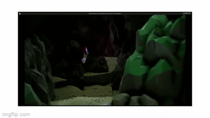

# CS7GV5 Animation Report
This is an interactive experience using Unreal Engine and Mixamo.

## Features
The project has the following features:

**Articulated Animated Character**: A pirate character with different animations such as running, jumping, and partying. The animations are from Mixamo and are blended and controlled by motion state machines and motion editing.

**Interactive Element**: The user can control the pirate and choose between two options: escape on the boat or stay with the gold. The choice triggers different cutscenes using blueprints and trigger actors.

**Principles of Animation**: The project applies the principles of animation such as anticipation, squash and stretch, ease in, ease out, exaggeration, and staging. The principles are implemented by keyframed motion, transform curves, and animation settings.

**Stylised Characters, Environment, Animations and Music**: The project has a low-poly pirate treasure island theme for the characters, environment, animations, and music. The project also uses smoke animation, lighting effects, and cheerful audio to match the theme.

**User Control of the Main Character and Tracking Camera**: The user can pilot the character using the keyboard and mouse and control the orbit of the camera around the character.

## Demo
You can watch a demo video of the project on YouTube: https://youtu.be/WM5l9ctl_Ys

  
  
  
  

